# Vision Transformers - Week 8 Group 2

This weeks papers are about Visual Transformers, particularly:
* **Swin Transformer** - [Swin Transformer: Hierarchical Vision Transformer using Shifted Windows, Liu, Lin, Cao, Hu, Wei, Zhang, Lin, Guo; 2021](https://arxiv.org/abs/2103.14030)
* **Transformer in Transformer** - [Transformer in Transformer, Han, Xiao, Wu, Guo, Xu, Wang; 2021](https://arxiv.org/abs/2103.00112)
* **Perceiver** - [Perceiver: General Perception with Iterative Attention, Jaegle, Gimeno, Brock, Zisserman, Vinyals, Carreira; 2021](https://arxiv.org/abs/2103.03206)
* **Peceiver IO** - [	Perceiver IO: A General Architecture for Structured Inputs & Outputs, Jaegle, Borgeaud, Alayrac, Doersch, Ionescu, Ding, Koppula, Zoran, Brock, Shelhamer, Hénaff, Botvinick, Zisserman, Vinyals, Carreira; 2021](https://arxiv.org/abs/2107.14795)
* **MLP-Mixer** - [	MLP-Mixer: An all-MLP Architecture for Vision, Tolstikhin, Houlsby, Kolesnikov, Beyer, Zhai, Unterthiner, Yung, Steiner, Keysers, Uszkoreit, Lucic, Dosovitskiy; 2021](https://arxiv.org/abs/2105.01601)

We experimented on following 3 Image-classification datasets:
* [CIFAR-10](https://www.cs.toronto.edu/~kriz/cifar.html)
* [STL-10](https://cs.stanford.edu/~acoates/stl10/)
* [Tiny ImageNet](https://www.kaggle.com/c/tiny-imagenet)

## Swin Transformer
The Swin Transformers were obtained through the use of the timm library (https://github.com/rwightman/pytorch-image-models). For pre-training we use Swin-B. Since we're training models with smaller inputs, when training from scratch we use models similar in dimensions to Swin-T. Following is a table with hyperparameters choices:
|             | Swin-B        | Swin-T       | Swin CIFAR-10 | Swin  STL-10 | Swin Tiny ImageNet |
| ----------- | ------------- | ------------ | ------------- | ------------ | ------------------ |
| img_size    | 224           | 224          | 32            | 96           | 64                 |
| embed_dim   | 128           | 96           | 64            | 64           | 64                 |
| depths      | 2, 2,  18, 2  | 2, 2, 6, 2   | 2, 2, 8, 2    | 2, 2, 8, 2   | 2, 2, 8, 2         |
| num_heads   | 4, 8,  16, 32 | 3, 6, 12, 24 | 2, 4, 8, 16   | 2, 4, 8, 16  | 2, 4, 8, 16        |
| patch_size  | 4             | 4            | 4             | 4            | 4                  |
| window_size | 7             | 7            | 8             | 12           | 8                  |

The model wasn't the most flexible to hyper parameter setting so although we would've ideally used  Swin-T for testing, it was not possible unless we wanted to do resizing to out input. All models were trained with learning rate 5e-4.

### **Results**
**CIFAR-10**
<p float="middle">
  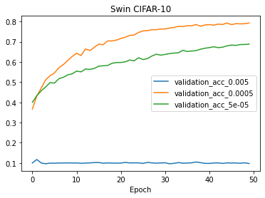
   
</p>

In the CIFAR dataset we see out best results with SWIN. Our model nearly reaches 80% validation accuracy and barely starts showing signs of converging. This additionally being the model with the smallest input data were able to use large batches  of size 1024.

**STL-10**
<p float="middle">
  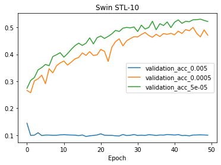
   
</p>

The training curve for the STL-10 Dataset looks similar to that of CIFAR's however  with lower overall results.  Additionally the curve is generally bumpier indicating that the model was having more difficulty converging.

**Tiny ImageNet**
<p float="middle">
  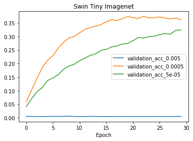
   
</p>

The tiny ImageNet model converged extremely quickly, especially compared to all the other models. This is probably due to the lack of data and variety of classes which allowed the model to memorize datapoints as opposed  to being able to generalize well to the data.

### **Pre-Training**
Fine-tuning a pre-trained model yielded extremely impresive results. Here are the accuracies after fine-tuning for one epoch

|               | Accuracy |
| ------------- | -------- |
| CIFAR-10      | 96.39%   |
| STL-10        |          |
| Tiny ImageNet |          |

### **Conclusion**
Although at times extremely impressive, I would consider the Swin Transformer extremely finicky. At times results were extremely random and finding a set of hyperparameters that set the model up for success was difficult. Changing certain  depths and window size often didn't show consistent trends and looking at the learning  rate there doesn't seem to be many changes. This results on models that often converge  to lower accuracies. On the other hand however, fine-tuning the model shows extremely impressive results when fine-tuning the model. This leads me to believe that this  model shines brightest in large scale settings  were many branching hyperparameters can be explored and pre-training is an option.

# Transformer in Transformer (TnT)

## Code
All training code for TnT experiments can be found in the folder `src/tnt`, the main training function is implemented in `src/tnt/train.py`. The training code is built over the code from [this](https://github.com/kentaroy47/vision-transformers-cifar10) github repo and TnT model code was directly taken from [this](https://github.com/lucidrains/transformer-in-transformer) repo. Pretrained TnT models were obtained from the [timm](https://github.com/rwightman/pytorch-image-models) library.

Sample training commands
``` bash
# train randomly initialized TnT model
python train.py --net tnt --dataset tiny-imagenet/cifar10/stl10 --lr 1e-4 --bs 128 --n_epochs 10

# train pretrained TnT model from timm (tnt_s_patch16_224)
python train.py --net tnt_timm --dataset tiny-imagenet/cifar10/stl10 --lr 1e-4 --bs 128 --n_epochs 10
```

## Experimental setup
### Model
We mainly experiment with following 2 types of TnT models
* `Rand-TnT`: Randomly initialized 6-layer TnT architecture with default `patch-size=4` and `pixel-size=2`
* `Pre-TnT`: Pretrained TnT model (TnT-S in the paper) from timm library (`tnt_s_patch16_224`)

### Augmentation
All experiments use following augmentation to input images, without augmentations we get noticable degradation in validation accuracy
``` python
transform_train = transforms.Compose([
    transforms.Resize(size),
    transforms.RandomCrop(size, padding=4),
    transforms.RandomHorizontalFlip(),
    transforms.ToTensor(),
    transforms.Normalize((0.4914, 0.4822, 0.4465), (0.2023, 0.1994, 0.2010)),
])

transform_test = transforms.Compose([
    transforms.Resize(size),
    transforms.ToTensor(),
    transforms.Normalize((0.4914, 0.4822, 0.4465), (0.2023, 0.1994, 0.2010)),
])
```

### Optimization
All models are trained with Adam optimizer and cosine learning rate schedule. Following default hyperparameters were used (unless specifically mentioned):
* Learning Rate (LR): 1e-4
* Batch-Size (BS): 128

## `Rand-TnT` Results
Train/Validation accuracy of `Rand-TnT` model across datasets at different learning rates
Dataset           | Validation                                                  |  Train
:----------------:|:-----------------------------------------------------------:|:----------------------------------------------------------------:
CIFAR-10 | 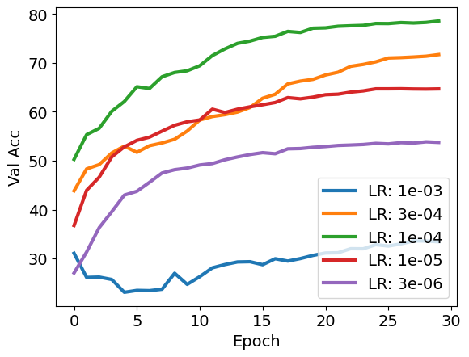 |   
STL-10 |  |   
Tiny-ImageNet |  |   

## `Pre-TnT` Results
Train/Validation accuracy of `Pre-TnT` model across datasets at different learning rates
Dataset           | Validation                                                  |  Train
:----------------:|:-----------------------------------------------------------:|:----------------------------------------------------------------:
CIFAR-10 | 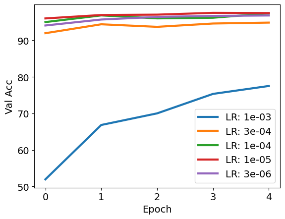 |   
STL-10 | 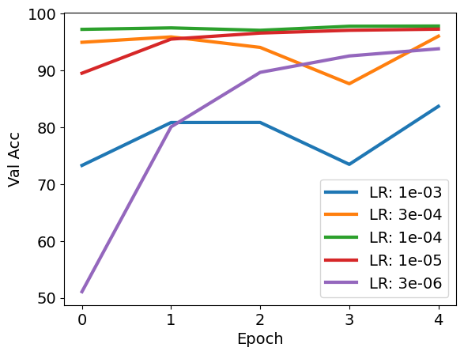 |  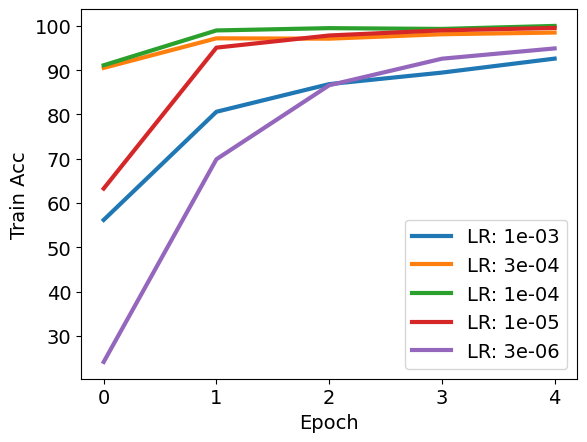 
Tiny-ImageNet |  |   

## Pixel size and Patch size ablation
Train/Validation accuracy of `Rand-TnT` model across datasets with different combination of Patch-size and Pixel-size
Dataset           | Validation                                                  |  Train
:----------------:|:-----------------------------------------------------------:|:----------------------------------------------------------------:
CIFAR-10 | 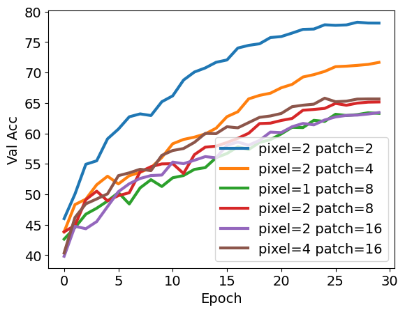 |   
STL-10 | 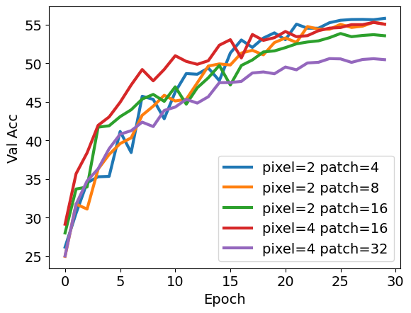 |   
Tiny-ImageNet | 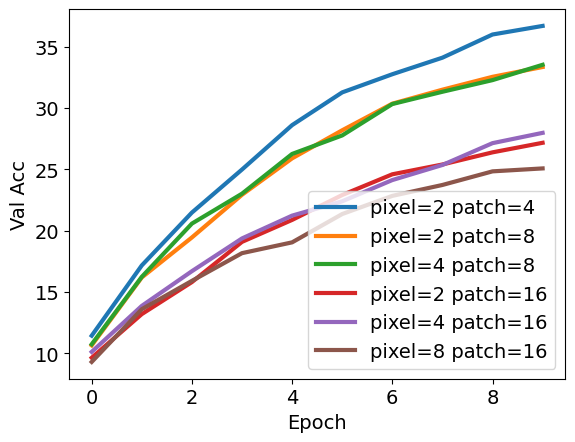 |  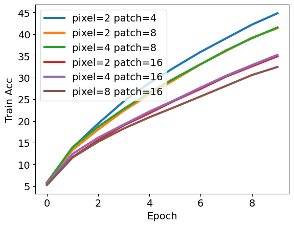 

## Conclusion
* With Pretraining TnT gets very good results but without pretraining it doesn't perform that impressive
* Smaller patch sizes and pixel sizes give better results across all 3 datasets for randomly initialized TnT models

# Perceiver

## Code
We adopted the publicly available implementation of Peceiver by **lucidrains** from its [Github repository](https://github.com/lucidrains/perceiver-pytorch/).
All of our experiment code can be found in the [`src/perceiver` directory](https://github.com/395t/coding-assignment-week-8-vit-2/blob/main/src/perceiver/). Below are commands to replicate our experiments.

```shell
# Train Perceiver models.
python main.py perceiver_cifar10{,_large,_xl}
python main.py perceiver_stl10{,_large,_xl}
python main.py perceiver_tinyimagenet_large{,_noaug}

# Plot graphs.
python plot.py plot_train \
    --dataset CIFAR-10 \
    --files result_perceiver_cifar10.yml,result_perceiver_cifar10_large.yml,result_perceiver_cifar10_xl.yml \
    --labels "Perceiver - Medium,Perceiver - Large,Perceiver - XLarge" \
    --out plots/cifar10_train

python plot.py plot_test \
    --dataset CIFAR-10 \
    --files result_perceiver_cifar10.yml,result_perceiver_cifar10_large.yml,result_perceiver_cifar10_xl.yml \
    --labels "Perceiver - Medium,Perceiver - Large,Perceiver - XLarge" \
    --out plot/cifar10_test
```

Replace `CIFAR-10` and `cifar10` with `STL-10` and `stl10` to plot graphs for STL-10.

## Experiment Setup

Due to computational constraints, we had to downsize our models.  That said, even after making the models smaller, our initial results exhibited significant overfitting.
The exact hyperparameters we used can be found under the [`src/perceiver/configs` directory](https://github.com/395t/coding-assignment-week-8-vit-2/blob/main/src/perceiver/configs/)

### Overfitting and Data Augmentation

To mitigate this, we introduced dropout of 0.2 at both attention as well as fully-connected layers.  We also added custom data augmentation (which we also hand-tuned).  Data augmentation was particularly important for smaller datasets (CIFAR-10 and STL-10). The list of augmentations we used can be found below:
```python
# All of the following are implemented in PyTorch data transforms.
ColorJitter(0.2, 0.2, 0.2, 0.2),
RandomHorizontalFlip(),
RandomVerticalFlip(),
RandomRotation(degrees=(0, 180)),
RandomAffine(degrees=15, translate=(0.2, 0.2),
      scale=(0.8, 1.2), shear=15,
      resample=Image.BILINEAR),
RandomEqualize(),
RandomAutocontrast(),
RandomAdjustSharpness(sharpness_factor=2),

# For STL-10, we optionally added:
RandomResizedCrop(96, scale=(0.5, 1)),
```
During training, we then randomly applied 1-4 of them for each example.

## Result: CIFAR-10

We train and compare three different network sizes for CIFAR-10.  They were trained for 100 epochs, all with data augmentation and dropout enabled as decribed above.
As you can see below, even with strong data augmentation and dropout, there is a substantial gap between train and test accuracies, especially for larger models.
Despite the large increase in train accuracies, test set performances were comparable for all three.

<p float="middle">
  
  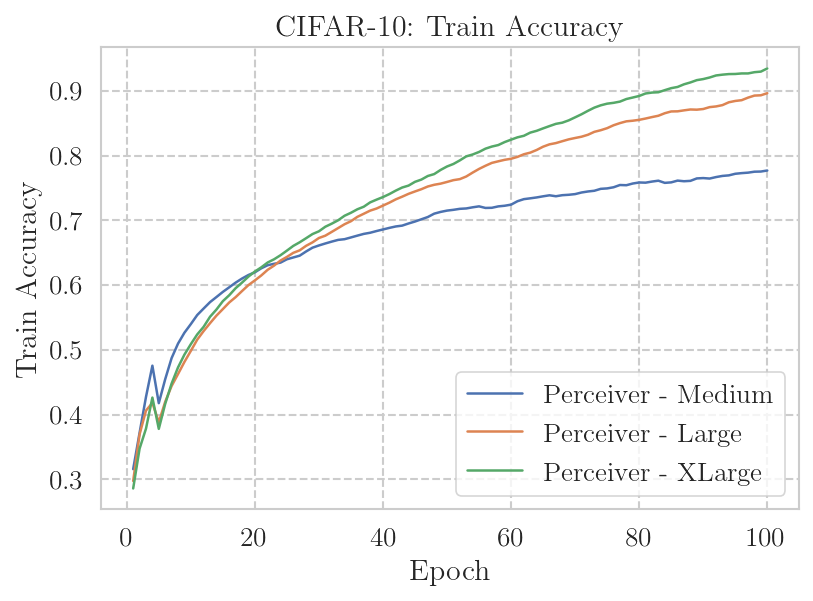
</p>

For reference, we include parameter counts of the three models.

|    | Medium | Large | XLarge |
| -- | -- | -- | -- |
| Parameter # | 293,362 | 1,151,730 | 4,428,262 |

Below we plot train/test loss curves after each epoch.  The behavior of these curves is more or less consistent with accuracy curves.  One interesting observation is that test losses start to increase for larger models due to overfitting, yet their test accuracies are still higher.

<p float="middle">
  
  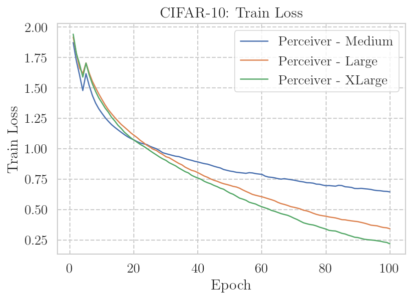
</p>

## Result: STL-10

We repeated the same experiment for STL-10.  Surprisingly, train/test accuracy curves exhibit a different behavior compared to the CIFAR-10 experiment.
One, the Large model outperforms both Medium and XLarge models in test set accuracy, even though its train accuracy is essentially identical to the XLarge model.

<p float="middle">
  
  
</p>

Expectedly, test losses show the ordering that is consistent with network sizes.  It is unclear why the Large model, which clearly seems to overfit to train set, achieves the best performance among the three.  Train losses match the train accuracy values exactly.

<p float="middle">
  
  
</p>

## Study: Effects of Dropout and Data Augmentation

To study the effects of dropout and data augmentation, we trained three different versions of the small CIFAR-10 Perceiver architecture. Below are test and train accuracy curves.

<p float="middle">
  
  
</p>

As clearly shown here, there is a substantial overfitting for the two models that did not use random augmentation.  We were surprised to find that dropout had such negligible effect.  With random augmentation, the gap between train and test accuracy was only about 10%, whereas the gap was ~36% for the other two.
The best test set accuracies across all epochs are included below:

|                     | None        | Only Dropout | Dropout & Augmentation |
| ------------------- | ----------- | ------------ | ---------------------- |
| Best Train Accuracy | **96.47 %** | 96.25 %      | 76.11 %                |
| Best Test Accuracy  | 60.37 %     | 60.47 %      | **66.12 %**            |

## Result: Tiny Imagenet

For Tiny Imagenet, we also trained three different models with different dropout and data augmentation strategies.

<p float="middle">
  
  
</p>

Surprisingly, in a contrast to the results from CIFAR-10 and STL-10, random augmentation did not help the model generalize better.
Moreover, the issue of overfitting was even more significant for Tiny Imagenet, which we expected to be the most complex dataset and to suffer the least from overfitting.  See the train loss curves  below.

<p float="middle">
  
  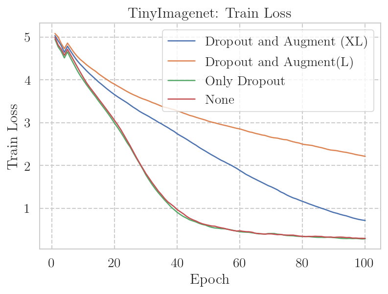
</p>

## Conclusion

As promised in the paper, we were able to train the same Perceiver architecture for multiple image resolutions without any modification.  Overfitting was a big issue, which made data augmentation and dropout necessary.
We were unfortunately unable to match the promised performance of Perceiver, falling shy of 70% test set accuracy for CIFAR-10, for example.


# Perceiver IO

### **Code Structure**

The code needed to replicate the Perceiver IO can be found in ``./notebooks/PerceiverIO/PerceiverIOTraining.ipynb``. The code for loading the datasets, creating a base model architecture, and the training code are located in this notebook. I would recommend taking this direct notebook and uploading it to Google Colab for use.

### **Commands to Run the Code**

The code for the experiments is in an ``.ipynb notebook`` that was created on run on colab. It includes the necessary install commands to directly run on colab. 

### **Task**

Use Perceiver IO Architecture for Image Classification

### **Model Architecture**

We used the [pytorch implementation by lucidrains](https://github.com/lucidrains/perceiver-pytorch) of the Perceiver IO architecture and determined the parameters of the model for each task. We also used a randomly generated query vector that had a size of ``(batch_size, 1, num_classes)`` that was jointly trained with the Perceiver IO model. Due to the PyTorch implementation, we reshaped images from (batch_size, num_channels, height, width) to (batch_size, 1, num_channels * height * width) before passing into the model. We used a cross entropy loss function and AdamW optimizer to train the model and the query vector. The output of the model is just a tensor of size (batch_size, output_labels). There were data augmentations also applied to the training images to boost performance. 

### **Conducted Experiments**

We tested out the PerceiverIO model trained from scratch on 3 different datasets. We recorded the training and test loss and accuracies for each dataset. We also ran an ablation study on the affect of learning rate and batch size on the model's performance. 


### **Results**

**CIFAR-10**

Pytorch Perceiver IO Model Parameters:

| Model Parameter | Vaue |
| ------------- | ------------- |
| dim  | 32 * 32 * 3  |
| queries_dim  |10  |
| logits_dim  | 10  |
| depth  | 2  |
| num_latents  | 32  |
| latent_dim  | 64  |
| cross_heads  | 1  |
|latent_heads| 8|
| cross_dim_head  | 128  |
| latent_dim_head  | 128  |


<p float="middle">
  
   
</p>

The following hyperparameters were fixed for this experiment: batch_size = 128, learning_rate = 3e-4. We trained a Perceiver IO model from scratch on CIFAR-10 images and were able to achieve a test set accuracy of 0.5619. At about 15 epochs, the test accuracy converged to about 55% accuracy. The model definitely overfit as the training set accuracy continued to grow much after the test set converged. 

**STL-10**

Pytorch Perceiver IO Model Parameters:

| Model Parameter | Vaue |
| ------------- | ------------- |
| dim  | 96 * 96 * 3  |
| queries_dim  |10  |
| logits_dim  | 10  |
| depth  | 2  |
| num_latents  | 96  |
| latent_dim  | 192  |
| cross_heads  | 1  |
|latent_heads| 8|
| cross_dim_head  | 64  |
| latent_dim_head  | 64  |

<p float="middle">
  
   
</p>

The following hyperparameters were fixed for this experiment: batch_size = 128, learning_rate = 3e-4. We trained another Perceiver IO model from scratch on the STL-10 dataset. The test set accuracy did not outperform the CIFAR-10 model and achieved a best test accuracy of 0.4748. There is also evidence of overfitting here as the model continued to get higher accuracies on the train data while the test set accuracy had converged.

**TinyImageNet**

Pytorch Perceiver IO Model Parameters:

| Model Parameter | Vaue |
| ------------- | ------------- |
| dim  | 64 * 64 * 3  |
| queries_dim  |200  |
| logits_dim  | 200  |
| depth  | 2  |
| num_latents  | 32  |
| latent_dim  | 64  |
| cross_heads  | 1  |
|latent_heads| 8|
| cross_dim_head  | 64  |
| latent_dim_head  | 64  |

<p float="middle">
  
   
</p>

The following hyperparameters were fixed for this experiment: batch_size = 128, learning_rate = 3e-4. Our from-scratch Perceiver IO model did poorly on this particularly dataset compared to the two previous models. There was massive overfitting when training this model on the TinyImageNet dataset as the discrepancy between training set and test set accuracy is apparent at the 17th epoch. 

**Batch Size Ablation Study**

We constructed multiple models with CIFAR-10 dataset. We also fixed the learning rate to be 3e-4. The batch sizes tested were 16, 32, 64, 128. The model parameters were fixed for this ablation experiment:

| Model Parameter | Vaue |
| ------------- | ------------- |
| dim  | 32 * 32 * 3  |
| queries_dim  |10  |
| logits_dim  | 10  |
| depth  | 2  |
| num_latents  | 32  |
| latent_dim  | 64  |
| cross_heads  | 1  |
|latent_heads| 8|
| cross_dim_head  | 128  |
| latent_dim_head  | 128  |

<p float="middle">
  
</p>

From the above graph, the batch size of Perceiver IO seems to not affect model performance on the CIFAR-10 dataset. The final test accuracies for all of these models was about the same. However, larger batch sizes did lead to slightly better test accuracy. Overall, we would say that the Perceiver IO model is robust to changes in batch size hyperparameter. We tested different batch sizes on the other datasets too which led to similar results as the the above ablation results.

**Learning Rate Ablation Study**

For 12 epochs, we fixed the batch size to 128. The learning rate we tested were 1e-1, 1e-2, 1e-3, and 1e-4. The model parameters are as follows:

| Model Parameter | Vaue |
| ------------- | ------------- |
| dim  | 32 * 32 * 3  |
| queries_dim  |10  |
| logits_dim  | 10  |
| depth  | 2  |
| num_latents  | 32  |
| latent_dim  | 64  |
| cross_heads  | 1  |
|latent_heads| 8|
| cross_dim_head  | 128  |
| latent_dim_head  | 128  |

<p float="middle">
  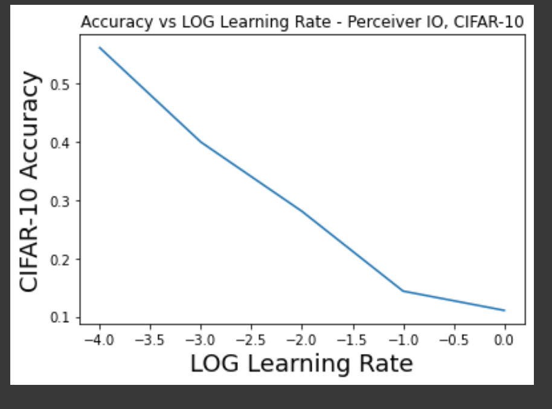
</p>

From the above graph, it appears to be the case that larger learning rates greatly lower performance for the CIFAR-10 dataset. The best test accuracy was found with the lower accuracy of 1e-4 while the worst test accuracy was 0.1108 when learning rate was equal to 1. Therefore, we conclude that the Perceiver IO model is not robust to changes in learning rate and favors larger learning rates during training. 

## **Conclusion**

| CIFAR-10 | STL-10 |  TinyImageNet |
| ------------- | ------------- | -----------|
| 56.19%  | 47.48%  | 12.01% |

Despite data augmentations, there was a good amount of overfitting with a lot of the models, and we did not hit the benchmarks with relatively low overall test accuracies. From the hyperparameter ablation studies, the Perceiver IO model appears to be more robust to batch size and not robust to the learning rate.

Although the results were alright, they could have been better and we believe these are some of the reasons why the Perceiver IO model's performance was subpar:

* **Model Depth**: Lack of computational resources restricted us from training deep versions of this model. We only kept the depth at 2 and believe we can achieve better results if we could train and evaluate with deeper models.
* **Queries**: We used a simpler approach for determining the query vector (specifically a randomized torch tensor). By using more complex methods to determine these queries, we believe we achieve better results.
* **Model Parameters**: Computational resource restrictions also limited our selection of the model parameters. By increasing the mode parameters such as nunmber of dimensions per cross attention and latent self attention heads, it is possible that better results are observed. 
* **Pre-Training**: We could have likely attained better results if we used a pre-trained Perceiver IO model on these datasets compared to the models trained from scratch.

# MLP-Mixer

### Code
Everything needed to replicate our MLP-Mixer experiments can be found in the [MLP-Mixer notebook](https://github.com/395t/coding-assignment-week-8-vit-2/blob/main/notebooks/MLP_Mixer.ipynb). The [timm PyTorch Image Models collection](https://github.com/rwightman/pytorch-image-models) is used to load the s16-224 MLP-Mixer architecture.

### Experiments: Training from scratch
The model was trained on Colab using Adam with varying batch sizes and learning rates. To save computation time and since our datasets are all fairly small, the small version of the model with 8 layers and patches of size 16x16 was chosen. The model was trained for 20 epochs each time for all datasets and hyperparameters. The datasets are augmented using RandomHorizontalFlip and ColorJitter.

### Results: Training from scratch
#### Tiny Imagenet
The model did not do well at all on Tiny Imagenet, reaching a final validation accuracy of 18% while overfitting on the training data completely. Based on the experiments with different leaning rates and batch sizes, 512 and 0.01 were chosen respectively.

<p float="middle">
  
   
</p>

### STL-10
There is a lot of overfitting on STL-10 as well. The model reaches a final validation accuracy of 44% with a batch size of 256 and a learning rate of 0.0001.

<p float="middle">
  
   
</p>

### CIFAR-10
Overfitting again on CIFAR. The chosen learning rate is 0.001 and the batch size 512, resulting in a validation accuracy of 59%.

<p float="middle">
  
   
</p>

## Conclusion: Training from scratch
Even though the data was augmented and the small model used, MLP-Mixer overfit on each dataset and did not yield satisfactory results. The authors promise good results when using models pretrained on ImageNet, which will be examined in the following section.

## Experiments: Fine-Tuning a pretrained model
In this part, a pretrained MLP-Mixer model was fine-tuned on the three datasets. Since no pretrained model was available for the S/16 version, a pretrained B/16 was used instead. This model has 12 instead of 8 layers and more than three times the parameters so a comparison between the two is not really fair. It should prove however, that very good results can be achieved on the small datasets without the massive overfitting seen before.
The model was fine-tuned for two epochs (except for Tiny ImageNet as Colab decided to revoke my GPU access after one epoch) with a learning rate of 0.00005 and a batch size of 32.

## Results: Fine-Tuning a pretrained model
| Dataset | CIFAR-10 | STL-10 | Tiny ImageNet |
| -- | -- | -- | -- |
| Validation Accuracy | 95% | 94.9% | 83.3%

