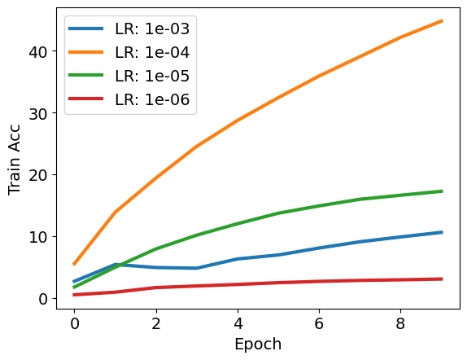

# Transformer in Transformer (TnT)

## Code
All training code for TnT experiments can be found in the folder `src/tnt`, the main training function is implemented in `src/tnt/train.py`. The training code is built over the code from [this](https://github.com/kentaroy47/vision-transformers-cifar10) github repo and TnT model code was directly taken from [this](https://github.com/lucidrains/transformer-in-transformer) repo. Pretrained TnT models were obtained from the [timm](https://github.com/rwightman/pytorch-image-models) library.

Sample training commands
``` bash
# train randomly initialized TnT model
python train.py --net tnt --dataset tiny-imagenet/cifar10/stl10 --lr 1e-4 --bs 128 --n_epochs 10

# train pretrained TnT model from timm (tnt_s_patch16_224)
python train.py --net tnt_timm --dataset tiny-imagenet/cifar10/stl10 --lr 1e-4 --bs 128 --n_epochs 10
```

## Experimental setup
### Model
We mainly experiment with following 2 types of TnT models
* `Rand-TnT`: Randomly initialized 6-layer TnT architecture with default `patch-size=4` and `pixel-size=2`
* `Pre-TnT`: Pretrained TnT model (TnT-S in the paper) from timm library (`tnt_s_patch16_224`)

### Augmentation
All experiments use following augmentation to input images, without augmentations we get noticable degradation in validation accuracy
``` python
transform_train = transforms.Compose([
    transforms.Resize(size),
    transforms.RandomCrop(size, padding=4),
    transforms.RandomHorizontalFlip(),
    transforms.ToTensor(),
    transforms.Normalize((0.4914, 0.4822, 0.4465), (0.2023, 0.1994, 0.2010)),
])

transform_test = transforms.Compose([
    transforms.Resize(size),
    transforms.ToTensor(),
    transforms.Normalize((0.4914, 0.4822, 0.4465), (0.2023, 0.1994, 0.2010)),
])
```

### Optimization
All models are trained with Adam optimizer and cosine learning rate schedule. Following default hyperparameters were used (unless specifically mentioned):
* Learning Rate (LR): 1e-4
* Batch-Size (BS): 128

## `Rand-TnT` Results

Dataset           | Validation                                                  |  Train
:----------------:|:-----------------------------------------------------------:|:----------------------------------------------------------------:
CIFAR-10 |  |   
STL-10 |  |   
Tiny-ImageNet |  |   

## `Pre-TnT` Results


## Pixel size and Patch size ablation

## Conclusion
* With Pretraining TnT gets very good results but without pretraining it doesn't perform very impressive
* Smaller patch sizes and pixel sizes give better results across all 3 datasets for randomly initialized TnT models
